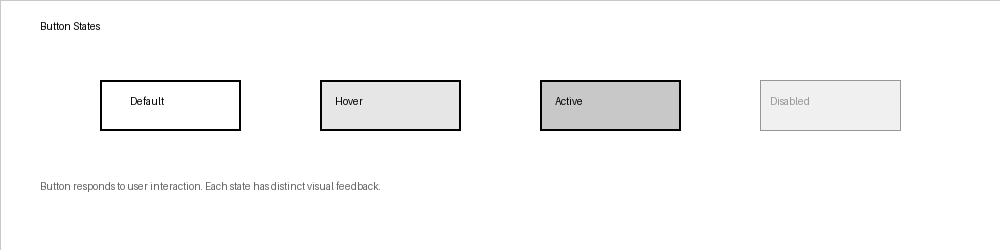
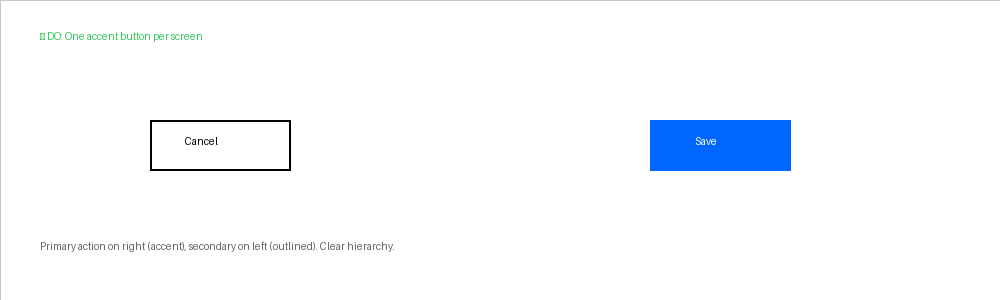
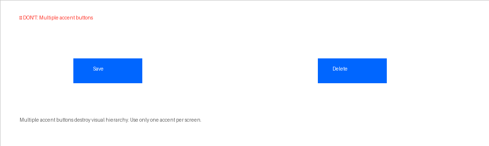

## Visual Examples



### ✅ Do



One accent button per screen (right), outlined on left. Clear hierarchy, easy scanning.

### ❌ Don't



Multiple accent buttons destroy hierarchy. User can't identify primary action.

---

## Do / Don't

| ✅ Do | ❌ Don't |
|---|---|
| One accent button per screen | Multiple accent buttons |
| Pair outlined + filled for hierarchy | Two filled buttons without hierarchy |
| Use action verbs: "Save", "Delete", "Continue" | Generic: "OK", "Submit", "Click here" |
| Use `loading={true}` for async | Disable + separate spinner |

---

## Imports

```tsx
import { Button } from '@shinetools/lumen-react';
import { Button } from '@shinetools/lumen-native';
```